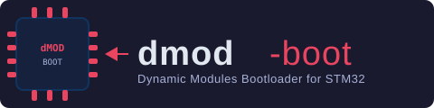

# dmod-boot

[](https://github.com/choco-technologies/dmod-boot/actions/workflows/build.yml)
[](LICENSE)

<p align="center">
  
</p>

Dynamic Modules (dMOD) bootloader - A minimalistic embedded project for STM32 microcontrollers.

## Setting Up Your Environment

### Option 1: Docker (Recommended for Easy Setup)

The easiest way to get started is to use the pre-configured Docker image that includes all necessary tools:

```bash
docker run -it --rm \
    -v $(pwd):/workspace \
    -w /workspace \
    chocotechnologies/dmboot:1.0.0 \
    bash
```

This Docker image includes:
- ARM GNU toolchain (arm-none-eabi-gcc)
- CMake
- Renode emulator
- All dMOD tools and libraries
- Python development environment

Once inside the container, you can proceed directly to [Building](#building).

### Option 2: Native Linux Setup

If you prefer to set up your Linux environment natively, we provide an automated setup script that installs all necessary tools and dependencies:

```bash
./scripts/setup-linux-env.sh
```

**What this script does:**
1. Calls the DMOD base environment setup (installs ARM toolchain, CMake, and other core tools)
2. Installs additional dMOD Boot specific packages:
   - Renode emulator
   - ncurses libraries (with automatic fallback for modern systems)
   - GTK libraries (with T64 ABI support)
   - Python 3 and pip
   - Other development utilities
3. Sets up the environment variables and bash aliases

**Advanced options:**

```bash
# Skip DMOD base setup if you've already set it up separately
./scripts/setup-linux-env.sh --skip-dmod-setup

# Specify custom tool directory
./scripts/setup-linux-env.sh --tools-dir /opt/tools

# Specify custom Renode version
./scripts/setup-linux-env.sh --renode-version 1.14.0

# View all available options
./scripts/setup-linux-env.sh --help
```

After running the script, restart your terminal or run:
```bash
source ~/.bashrc
```

## Building

### Building for Hardware

```bash
mkdir build
cd build
cmake ..
cmake --build .
```

### Selecting a Target or Board

By default, the build targets the `STM32F746xG` microcontroller. You can select a different target or use a predefined board configuration:

**Using the `TARGET` parameter** – specify a microcontroller directly:

```bash
cmake -DTARGET=STM32F407G -S . -B build
cmake --build build
```

Supported values: `STM32F746xG`, `STM32F407G`, `STM32F746ZG`, `ESP32S3`.

**Using the `BOARD` parameter** – select a ready-made board configuration that automatically sets `TARGET` and other board-specific settings:

```bash
cmake -DBOARD=stm32f746g-disco -S . -B build
cmake --build build
```

Board configuration files are located in `configs/board/<BOARD>/board.cmake`. When `BOARD` is set, the `TARGET` parameter is ignored.

### Building for LILYGO T-Deck Pro

The T-Deck Pro is based on the **ESP32-S3FN16R8** (Xtensa LX7 dual-core, 240 MHz, 16 MB flash, 8 MB PSRAM).

**Prerequisites:**

- [Espressif ESP32-S3 toolchain](https://docs.espressif.com/projects/esp-idf/en/latest/esp32s3/get-started/linux-macos-setup.html) (`xtensa-esp32s3-elf-gcc`)
- [Espressif OpenOCD fork](https://github.com/espressif/openocd-esp32) (supports the built-in USB JTAG of the ESP32-S3)

**Build using the board preset:**

```bash
cmake -DBOARD=t-deck-pro -S . -B build
cmake --build build
```

**Or specify the target directly:**

```bash
cmake -DTARGET=ESP32S3 -S . -B build
cmake --build build
```

**Flash via OpenOCD** (T-Deck Pro has a built-in USB JTAG, no external probe needed):

```bash
cmake --build build --target install-firmware
```

This runs:
```
openocd -f interface/esp_usb_jtag.cfg -f target/esp32s3.cfg \
        -c "program dmboot.elf verify reset exit"
```

> **Note:** The firmware is loaded directly into IRAM/DRAM, bypassing the ROM bootloader's cache setup. This makes the development cycle fast and requires no partition table or bootloader binary.

### Building for Renode Simulation

To build for Renode simulation (useful for automated testing without hardware):

```bash
mkdir build
cd build
cmake -DDMBOOT_EMULATION=ON ..
cmake --build .
```

With emulation mode enabled, the workflow targets (`install-firmware`, `connect`, `monitor-gdb`) work similarly to hardware mode but use Renode instead of OpenOCD.

**Why Renode?** Renode provides excellent STM32F7 Discovery board emulation with complete peripheral support, accurate memory mapping, and full interrupt controller implementation. This enables proper firmware execution and log capture via monitor-gdb, making it ideal for CI testing and verification.

### Building with Embedded Files

You can optionally embed binary files in ROM during the build:

```bash
cmake -DCMAKE_BUILD_TYPE=Debug \
      -DTARGET=STM32F746xG \
      -DSTARTUP_DMP_FILE=path/to/startup.dmp \
      -DUSER_DATA_FILE=path/to/user_data.dat \
      -DDMBOOT_CONFIG_DIR=path/to/config_directory \
      -S . -B build
cmake --build build
```

**Build Parameters:**
- `TARGET` (optional, defaults to `STM32F746xG`) - Target microcontroller. Supported values: `STM32F746xG`, `STM32F407G`, `STM32F746ZG`, `ESP32S3`. Ignored when `BOARD` is set.
- `BOARD` (optional) - Board name. When set, `TARGET` and other board-specific settings are automatically derived from `configs/board/<BOARD>/board.cmake`, so you don't need to set `TARGET` manually. Examples: `-DBOARD=stm32f746g-disco`, `-DBOARD=t-deck-pro`.
- `STARTUP_DMP_FILE` (optional) - Path to a startup package file (`.dmp`) that will be automatically loaded using `Dmod_AddPackageBuffer` at boot
- `USER_DATA_FILE` (optional) - Path to a user data file that will be embedded in ROM, with its address and size available via environment variables `USER_DATA_ADDR` and `USER_DATA_SIZE`
- `DMBOOT_CONFIG_DIR` (optional, defaults to `build/configs`) - Path to a directory that will be converted to a dmffs filesystem image and mounted at `/configs/` at boot time. By default, configuration files from `modules.dmd` are downloaded to this directory.
- `DMBOOT_MAIN_MODULE` (optional, defaults to `dmell`) - Name of the main module to start after boot. Set to empty string to disable.
- `DMBOOT_MAIN_MODULE_CONFIG` (optional) - Configuration file for the main module (e.g. `board/stm32f746g-disco.ini`). Only used when `DMBOOT_MAIN_MODULE` is set. When specified, this config is passed to `dmf-get` when downloading the main module.
- `DMBOOT_EXTRA_FLASH_DMD_MANIFESTS` (optional) - Semicolon-separated list of manifest paths/URLs (one per extra flash.dmd file). Use this to specify a custom manifest for each extra flash.dmd file.
- `DMBOOT_EXTRA_SDCARD_DMD_FILES` (optional) - Semicolon-separated list of additional `sdcard.dmd` files. Each file adds more sdcard modules to download at build time.
- `DMBOOT_EXTRA_SDCARD_DMD_MANIFESTS` (optional) - Semicolon-separated list of manifest paths/URLs (one per extra sdcard.dmd file). Use this to specify a custom manifest for each extra sdcard.dmd file.
- `DMBOOT_EMULATION` (optional) - Enable Renode simulation mode instead of hardware mode

**Automatic Build-Time Embedding:**
- `modules.dmp` - Automatically created and embedded during build if modules are specified in `modules/modules.dmd`. This file is loaded before `startup.dmp` at boot time. If no modules are defined, the file won't exist, which is not an error.

All parameters are optional. If not specified, the build will proceed with default settings.

For a full list of all available CMake options (including DMOD library and VFS configuration), see [docs/cmake-options.md](docs/cmake-options.md).

## CMake Targets

The following targets work in both hardware mode (with OpenOCD) and Renode simulation mode. The workflow is identical regardless of the mode.

### `install-firmware`
Install firmware on the target.

- **Hardware mode:** Flashes firmware to the microcontroller via OpenOCD
- **Renode mode:** Copies firmware to a known location for Renode to use

```bash
cmake --build . --target install-firmware
```

### `connect`
Connect to the target and start the debug server.

- **Hardware mode:** Starts OpenOCD server that allows debugging and monitoring
- **Renode mode:** Starts Renode with GDB server on port 3333

```bash
cmake --build . --target connect
```

Keep this running in one terminal while using other debugging/monitoring tools.

### `monitor`
Monitor logs from the firmware in real-time via OpenOCD. This target:
- Automatically builds the `dmlog_monitor` tool for the host architecture
- Extracts the ring buffer address from the firmware's map file
- Runs `dmlog_monitor` with the correct configuration

**Usage:**

In one terminal, start OpenOCD:
```bash
cmake --build . --target connect
```

In another terminal, start the monitor:
```bash
cmake --build . --target monitor
```

The monitor will display logs from the firmware in real-time. Press Ctrl+C to exit.

### `monitor-gdb`
Monitor logs from the firmware in real-time via GDB server. This target:
- Automatically builds the `dmlog_monitor` tool for the host architecture
- Extracts the ring buffer address from the firmware's map file
- Runs `dmlog_monitor` with GDB backend configuration

This target works identically in both hardware and Renode modes, as it connects via the GDB protocol.

**Usage:**

In one terminal, start the debug server:
```bash
cmake --build . --target connect
```

In another terminal, start the monitor using GDB mode:
```bash
cmake --build . --target monitor-gdb
```

The monitor will connect to the GDB server at `localhost:3333`. Press Ctrl+C to exit.

**Note:** Both OpenOCD and Renode provide a GDB server on port 3333. The `monitor-gdb` target connects to this GDB server interface using the GDB Remote Serial Protocol, which is an alternative to using OpenOCD's telnet interface (port 4444) used by the `monitor` target. Both methods work equally well for monitoring logs.

### `debug`
Start GDB and connect to OpenOCD for debugging.

```bash
cmake --build . --target debug
```
